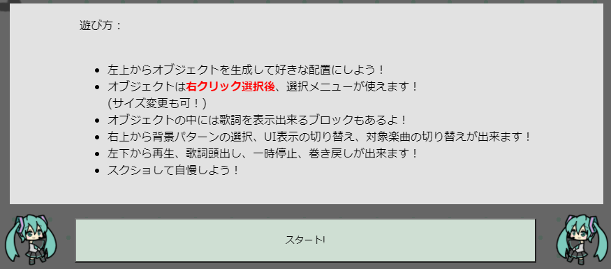
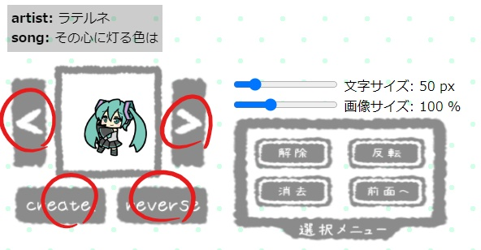
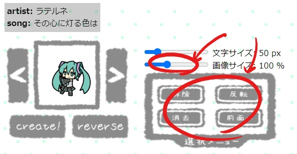
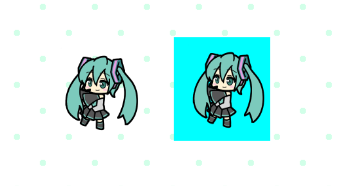
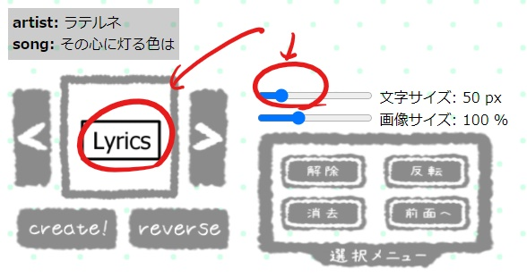
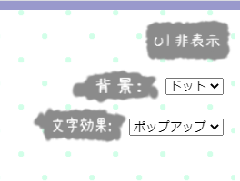
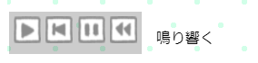
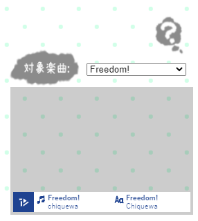
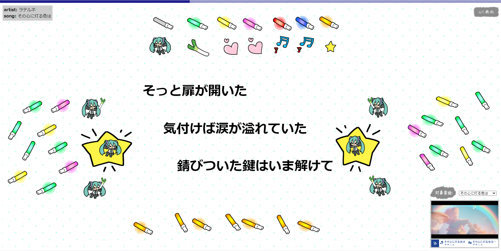

# マジカルミライ2021 プログラミングコンテスト
# 配置 de PV

オブジェクトや歌詞Boxを生成して配置することでPV風アニメーションを作成することが出来るアプリです。
課題曲すべてに対応していますが元PVはyoutube参照の場合のみ対応しています。
背景や文字効果、オブジェクトのサイズ変更で好みの演出が作成出来ます。(出力未対応)

本プログラムはTextAlive App APIサンプルコードであるTextAlive App API basic exampleを参考に作成しました。
- サンプルコードのページ: https://github.com/TextAliveJp/textalive-app-basic
## ビルド
以下のコマンドで `docs` 以下にビルド済みファイルが生成されます。(たぶん！)
```sh
npm install
npm run build
```

# 使用方法
## help記載情報
 
## 画像付き操作説明
- 楽曲読み込み後、スタートボタンで開始します。  
- 矢印ボタンでオブジェクト候補の変更、createボタンでオブジェクトの作成、reverseボタンでオブジェクト作成時の反転が出来ます。  
  (画面左上は楽曲情報が表示されます。)

- 作成したオブジェクトを右クリックで選択後、選択メニューと画像サイズが有効になります。  
  選択の全体解除、全体反転、全体消去、重なり時の優先度を前面にする操作が可能です。


- lyricsオブジェクトは歌詞のフレーズが表示されます。(複数作成可)  
  文字サイズは全てのlyricsオブジェクトに対していつでも有効です。(選択する必要はありません。)  
  lyricsオブジェクトの削除は右クリックで選択後、選択メニューから行ってください。

- 画面右上UI非表示ボタンでUIの表示切り替えが出来ます。  
  背景のプルダウンメニューから背景パターンの選択が出来ます。  
  文字効果のプルダウンメニューから歌詞出現の効果パターンの選択が出来ます。  

- 画面左下に楽曲操作パネルがあります。  
  再生、歌詞の頭出し、一時停止、楽曲最初への巻き戻しの順になっています。  
  操作パネル横には現在対象としている歌詞のフレーズが表示されています。

- 画面右下にはヘルプ表示ボタン、対象楽曲変更用プルダウンメニュー、元PV表示窓、楽曲情報が表示されています。  
  対象楽曲はプルダウンメニューから選択して頂くことでいつでも変更可能です。  
  参照元がyoutubeの場合灰色部に元PVが再生されます。  

## 作成例

## 対象楽曲
- [blues / First Note]
- [chiquewa / Freedom!]
- [ラテルネ / その心に灯る色は]
- [真島ゆろ / 嘘も本当も君だから]
- [シロクマ消しゴム / 夏をなぞって]
- [濁茶 / 密かなる交信曲]

# 開発メンバ
```sh
プログラム: upc1712goto
画像素材: Milch @Milch_puyo
```
## TextAlive App API


TextAlive App API は、音楽に合わせてタイミングよく歌詞が動くWebアプリケーション（リリックアプリ）を開発できるJavaScript用のライブラリです。

TextAlive App API について詳しくはWebサイト [TextAlive for Developers](https://developer.textalive.jp/) をご覧ください。

### ボタン制作に使用させて頂いたフォント
    フォント名：あんずもじ/あんずもじ等幅/あんずもじ奏/あんずもじ湛
    作成者：京風子（Kyoko）
    配布サイト名：あんずいろapricot×color　
    URL：http://www8.plala.or.jp/p_dolce/

